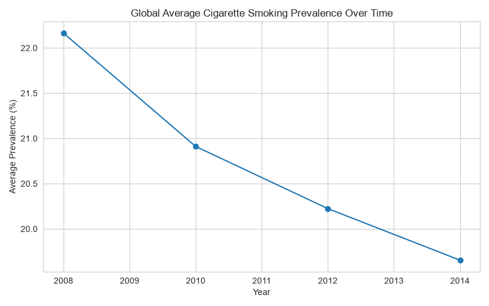
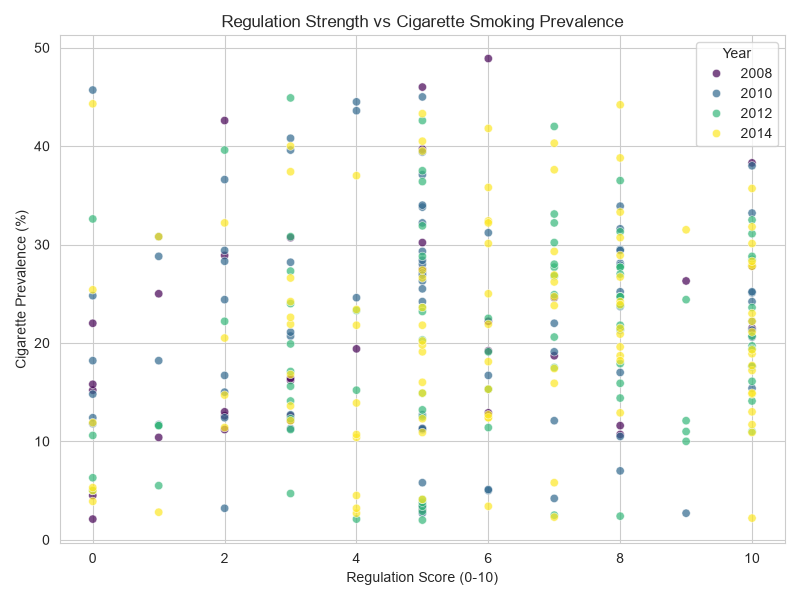
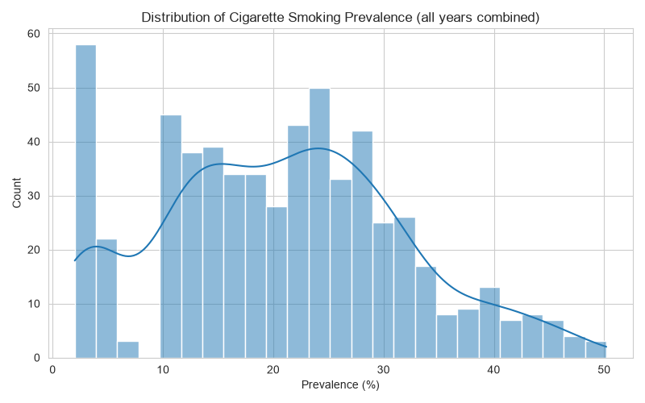

# Smoking & Tobacco Policy Analysis (2008–2014)

## What is this project about?
Smoking is a major health issue worldwide, and many countries have introduced rules — like banning smoking in restaurants, offices, and public transport — to try to reduce it. This project looks at real data from 149 countries between 2008 and 2014 to answer one simple question:

**Do countries with stronger anti-smoking rules actually have fewer smokers?**

## Where did the data come from?
The data covers 149 countries, tracked across 4 different years (2008, 2010, 2012, 2014). For each country and year, it records things like:
- What percentage of people smoke cigarettes
- The price of the most popular cigarette brand
- Whether the country has health warnings on cigarette packs
- Whether smoking is banned in places like schools, hospitals, restaurants, and public transport
- How strong the country's overall smoke-free policies are (rated on a scale)

## Cleaning up the data
Real-world data is almost never ready to use right away, and this dataset had a few issues I had to fix first:

- **Numbers were mixed with text.** Instead of just "46.8%", the smoking rate was written like `"46.8 [35.3 – 56.3]"` — the second part is a confidence range (basically, "we're fairly sure the real number is somewhere between 35.3 and 56.3"). I separated this into clean, usable numbers.
- **Missing data was labeled in different, inconsistent ways** — some cells said "Not available," others said "Not applicable," and one column even used a random "x." I made all of these consistent so the computer would recognize them as missing data instead of treating them as real answers.
- **Prices had commas in them** (like "1,074") which computers read as text, not numbers — I cleaned this so it could be used in calculations.
- **Some columns about smoking bans were empty for earlier years** but had real data in 2014. Instead of deleting these columns, I kept them, since this shows those specific rules simply weren't tracked yet in earlier years.
- Finally, I combined all 4 separate yearly files into a single big dataset so I could compare across years.

## What did I find?

### 1. Smoking is going down globally


Looking at the average across all countries, the percentage of people who smoke cigarettes has been slowly decreasing from 2008 to 2014. That's a good sign for public health.

### 2. Stricter rules don't always mean fewer smokers


This was the most surprising part. I expected that countries with the strictest smoking bans would automatically have the fewest smokers — but the data shows this isn't strongly true. Some countries with very strong smoke-free rules (like Spain, Germany, and Hungary) still had a high percentage of smokers. This suggests that rules alone aren't the full story — things like culture, how well rules are actually enforced, and how addictive smoking already is in a population probably matter just as much.

### 3. Smoking rates vary a lot country to country


There's no single "typical" smoking rate — some countries have very few smokers, others have very high percentages, and there's a wide range in between.

## What does this mean?
Anti-smoking policies are likely helpful, but they're not a magic fix on their own. A government that wants to reduce smoking probably needs to combine strong rules with other things — like making sure those rules are actually enforced, running health awareness campaigns, and understanding why people smoke in the first place.

## A note on the data's limits
The information about smoking bans (schools, restaurants, etc.) was only properly recorded in 2014 — earlier years didn't track it. So any conclusions about "rules vs. smoking rates" are based mostly on that one year, not the full 2008–2014 period.

## What I'd explore next
- Add newer data (if available) to see if this trend continues
- Look at income/wealth data per country — richer countries might enforce rules differently
- Do a deeper statistical test to measure exactly how strong (or weak) the link between rules and smoking rates really is

## Tools used
Python (pandas for cleaning data, matplotlib and seaborn for charts)

## Project files
```
├── data/
│   ├── raw/           → the original files, untouched
│   └── cleaned/        → the cleaned, combined dataset
├── scripts/
│   ├── clean_data.py                    → cleans and combines the data
│   └── eda_policy_vs_prevalence.py      → analyzes it and creates charts
├── charts/              → the graphs shown above
└── README.md
```